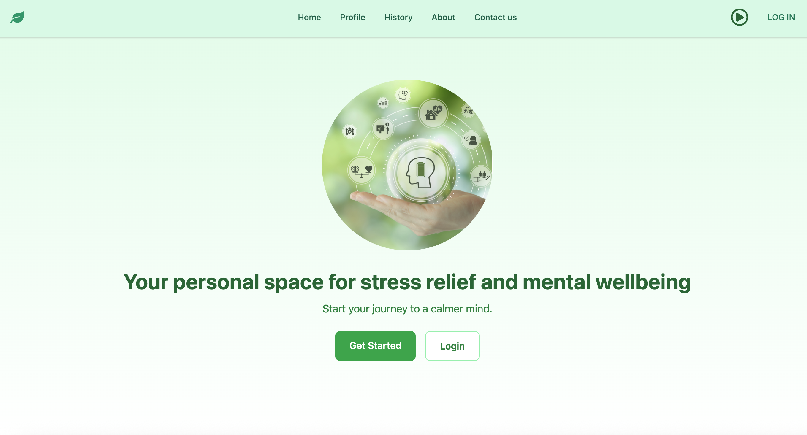

# Stress-Flow 🌿

A comprehensive React-based web application designed to help users manage stress and improve their mental well-being through mood tracking, stress assessment, calming music, and daily wellness tips.

##  Technology Stack

- **Frontend**: React 19.1.0 with Vite
- **Styling**: Tailwind CSS 4.1.11
- **UI Components**: Material-UI (MUI) 7.3.1
- **Icons**: Lucide React, React Icons, Heroicons
- **Authentication**: Firebase Auth
- **Database**: Firebase Firestore
- **Routing**: React Router DOM
- **Notifications**: React Toastify
- **Build Tool**: Vite 7.0.4



## ✨ Features

###  **Home Dashboard**
- Welcoming landing page with meditation imagery
- Quick access to stress assessment survey
- User authentication status display

###  **Stress Assessment Survey**
- 10-question psychological stress evaluation
- Interactive step-by-step questionnaire
- Real-time progress tracking
- Comprehensive stress level analysis and results

###  **Mood Tracking**
- Daily mood logging with 5-point scale (Very Sad to Very Happy)
- Visual mood selection with emoji-style icons
- Mood history storage and tracking
- Firebase integration for data persistence

###  **Calming Music Player**
- 6 curated meditation and relaxation tracks
- Intuitive music player interface
- Play/pause controls
- Auto-play next track functionality

###  **Daily Wellness Tips**
- Curated list of stress-relief techniques
- Simple, actionable daily recommendations
- Clean, easy-to-read interface

###  **User Authentication**
- Secure login and signup functionality
- Firebase Authentication integration
- Protected routes for personalised features
- Session management with localStorage


## 📁 Project Structure

```
src/
├── components/      
│   ├── AudioPlayer.jsx
│   ├── MainContent.jsx
│   ├── MoodTracker.jsx
│   ├── Result.jsx
│   └── SideBar.jsx
├── context/      
│   └── Authcontext.jsx
├── functions/          
│   ├── Calculate.js
│   ├── handleLogout.js
│   ├── SaveHistory.js
│   ├── SaveMood.js
│   ├── UseMoodHistory.js
│   └── UseStressHistory.js
├── pages/            
│   ├── CalmingMusic.jsx
│   ├── DailyTipsPage.jsx
│   ├── Home.jsx
│   ├── Login.jsx
│   ├── MoodPage.jsx
│   ├── Signup.jsx
│   ├── Survey.jsx
│   └── Userpage.jsx
├── routers/          
│   ├── PrivateRoute.jsx
│   └── RoutersConfigs.jsx
├── music/            
├── image/           
├── App.jsx            
├── Firebase.jsx      
└── main.jsx     
```


🔄 **In Development:**
- Enhanced user dashboard
- Data visualisation for mood/stress trends
- Additional meditation content
- Mobile app optimisation
- Calming music player
- Daily wellness tips
- Mood tracking functionality

